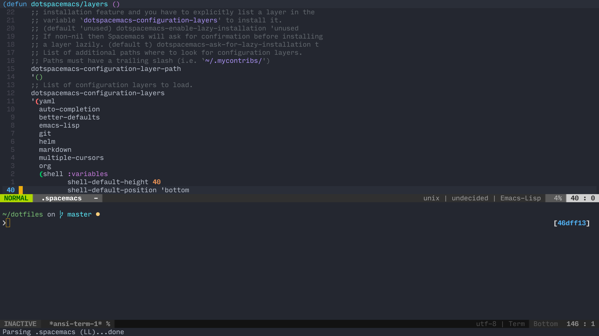

# Dotfiles


My dotfiles for various application configurations on Linux.

I am currently running Manjaro Linux with my desktop manager as KDE.

## Getting started
To get started, clone the repository.

```bash
$ git clone https://github.com/woojiahao/dotfiles.git ~/dotfiles
```

I have several parts to my system setup, for instance, I use an Ergodox EZ, so I have a script for Wally, a firmware flashing tool for the Ergodox.

## Software installation
The initial setup for my system is automated with the `./installers/setup`.

**Note:** ZSH is not installed with the script, in order for it to be installed, you can follow the instructions found [here.](https://github.com/robbyrussell/oh-my-zsh)

```bash
$ chmod +x ~/dotfiles/installers/arch-setup
$ sudo ~/dotfiles/installers/arch-setup
```

This will install all the software I use on a daily basis, for an exhaustive list of them, you can find them [here.]()

### Wally
If you use an Ergodox EZ and make use of the Wally tool provided to flash new layouts, you can use the installer script to set up a `.desktop` file to launch Wally automatically.

```bash
$ chmod +x ~/dotfiles/installers/wally/wally-setup
$ sudo ~/dotfiles/installers/wally/wally-setup
```

## Loading commands
In order to keep the shell files clean, commands/alias are loaded from the =/scripts= folder. To add these scripts, add the following command to the end of your =.bashrc= or =.zshrc=.

#+begin_src bash
for file in ~/linux/scripts/#; do
source $file
done
#+end_src
